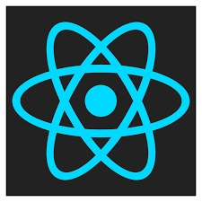

    
    <h1>Next Level Week #4</h1>

 
<ul>
    <a href='#01'>
        <li>&nbsp; Day 01 - Fundamentos do React</li>
    </a>
     
    <a href="#">
        <li>&nbsp; Day 02 - Next.Js</li>
    </a>
     
    <a href="#">
        <li>&nbsp; Day 03 - Context API</li>
    </a>
     
    <a href="#">
        <li>&nbsp; Day 04 - Use Effect e Notification</li>
    </a>
</ul>

 

   <h1>Day 01 - Fundamentos do React</h1>
    
   <h2>Criando o Projeto</h2>
   

    
   <h3>Yarn</h3>
    
   <code>C:\Users\usuario\Documentos\NLW4> yarn create react-app moveit --template=typescript</code> 
     
   <h3>Npm</h3>
    
   <code>C:\Users\usuario\Documentos\NLW4> npx create-react-app moveit --template=typescript</code> 
     
   <h2>Startando o Projeto<h2>
   

    
   <h3>Yarn</h3>
    
   <code>C:\Users\usuario\Documentos\NLW4\moveit> yarn start</code> 
     
   <h3>Npm</h3>
    
   <code>C:\Users\usuario\Documentos\NLW4\moveit> yarn start</code> 
     
   <h2>Criando Componentes no ReactJs</h2>
   

   <h3>Criando Componentes no ReactJs</h3>
   <code>
    export function MostrarTexto(){
	return(
			

					<h1>Bem Vindo A RocketSeat</h1>
					#Juntos Para o Proximo Nivel
			

	)
}
   </code>

