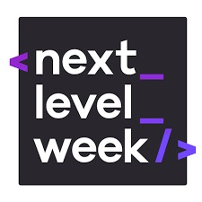
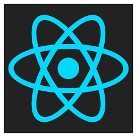
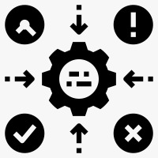
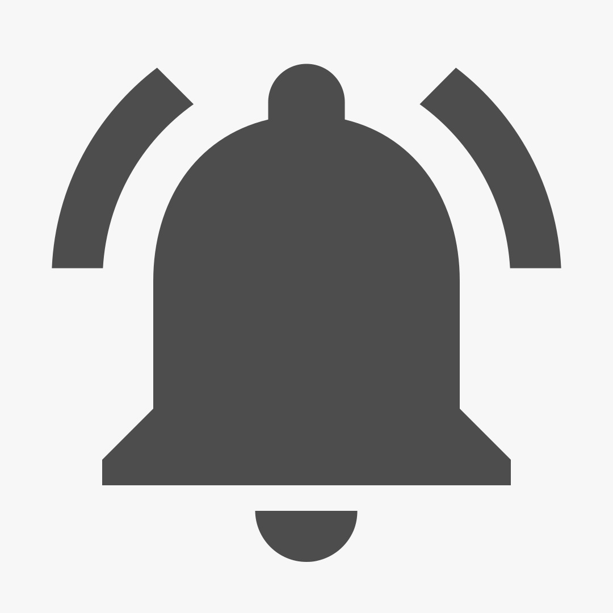

# Next Level Week #4

[ &nbsp;  Day 01 - Fundamentos do React](#Day-01)
<br>
[ &nbsp;  Day 02 - Next.Js](#day-02)
<br>
[ &nbsp; Day 03 - Context API](#day-01)
<br>
[ &nbsp;   Day 04 - Use Effect e Notification](#day-01)

****
## __Day 01__

<br>

## *Criando o Projeto*
### Yarn:
```
C:\Users\usuario\Documentos\NLW4> yarn create react-app moveit --template=typescript
```

### Npm:
```
C:\Users\usuario\Documentos\NLW4> npx create-react-app moveit --template=typescript
```

<br>

## *Startando o Projeto*
### Yarn:
```
C:\Users\usuario\Documentos\NLW4\moveit> yarn start
```

### Npm:
```
C:\Users\usuario\Documentos\NLW4\moveit> npm start
```

<br>

## *Criando Componentes no React JS*
### Componente.tsx
```
    export function MostrarTexto(){
	return(
			<div className='container'>
					<h1>Bem Vindo A RocketSeat</h1>
					<span>#Juntos Para o Proximo Nivel</span>
			</div>
	)
}
```

****
## Day 02 - Next.Js
****
## Day 03 - Context API
****
## Day 04 - Use Effect e Notification

